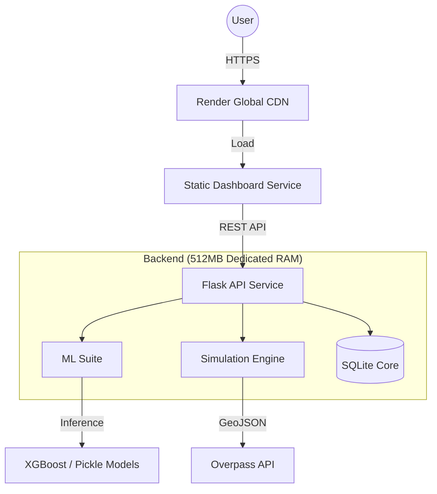

# 🌍 CrisisConnect: AI-Powered Disaster Intelligence

[](https://crisis-connect-dashboard.onrender.com)
[](https://www.python.org/)
[](https://xgboost.readthedocs.io/)
[](https://opensource.org/licenses/MIT)

> **Predicting the unpredictable.** CrisisConnect is a high-fidelity, real-time command center for disaster response, leveraging advanced ML pipelines and physics-based simulations to save lives.


---

## 🧠 The Intelligence Suite

CrisisConnect isn't just a dashboard; it's a multi-model cognitive engine. We utilize **5 specialized ML pipelines** to process data from the ground up:

1.  **🏘 Displacement Prediction (XGBoost)**: Forecasts population movement based on conflict intensity, infrastructure resilience, and demographic density.
2.  **🌊 Physics-Based Drift Model**: Simulates the trajectory of survivors or resources in water/wind-driven disasters using differential vector mathematics.
3.  **🔥 Hotspot Clustering (DBSCAN)**: Automatically identifies emerging epicenters of distress from real-time alert streams.
4.  **🛣 Route Optimization (NetworkX)**: Calculates the most efficient survival corridors, accounting for terrain risk and infrastructure damage.
5.  **⚠️ Secondary Risk Evaluator**: A heuristic engine that predicts cascading failures (e.g., dam breaks after earthquakes).

---

## 📡 Real-time Command Center

The dashboard provides a **high-refresh-rate overview** of the disaster zone, integrating real-world geospatial data:

-   **Live OSM Integration**: Dynamically fetches hospitals, police stations, and community centers via the **Overpass API**.
-   **Field Station Generation**: When infrastructure fails, the system heuristically generates ML-driven optimal medical zones.
-   **Drift Animation**: Real-time visualization of resource paths and debris movement.


---

## 🏗 High-Performance Architecture

Optimized for deployment on **Render**, we utilize a split-service architecture to maximize resource allocation:



---

## 🛠 Tech Stack

| Category | Technology |
| :--- | :--- |
| **Backend** | Python 3.11, Flask, Gunicorn |
| **ML Engine** | XGBoost, Scikit-learn, NetworkX, NumPy, Pandas |
| **Frontend** | Vanilla JavaScript (ES6+), CSS Grid/Flexbox |
| **Geospatial** | Leaflet.js, OpenStreetMap, Overpass API |
| **Deployment** | Render (Web Service + Static Site) |

---

## 🚦 Getting Started

### Local Development
1. **Clone & Setup Backend**:
   ```bash
   cd backend
   pip install -r requirements.txt
   python run.py
   ```
   *Backend will start on `http://127.0.0.1:5001`*

2. **Open Frontend**:
   Simply open `frontend/index.html` in your browser. The system will automatically detect the local backend.

### Production Deployment
The project is pre-configured for Render.
- **Backend Service**: Set build command to `pip install -r backend/requirements.txt`.
- **Static Site**: Set `publishPath` to `frontend`.

---

## 📄 License
This project is licensed under the MIT License - see the [LICENSE](LICENSE) file for details.

*CrisisConnect: Intelligence that moves at the speed of crisis.*
